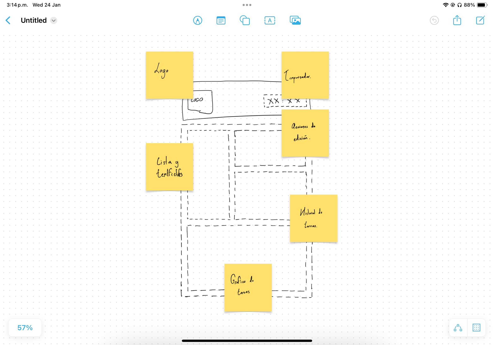
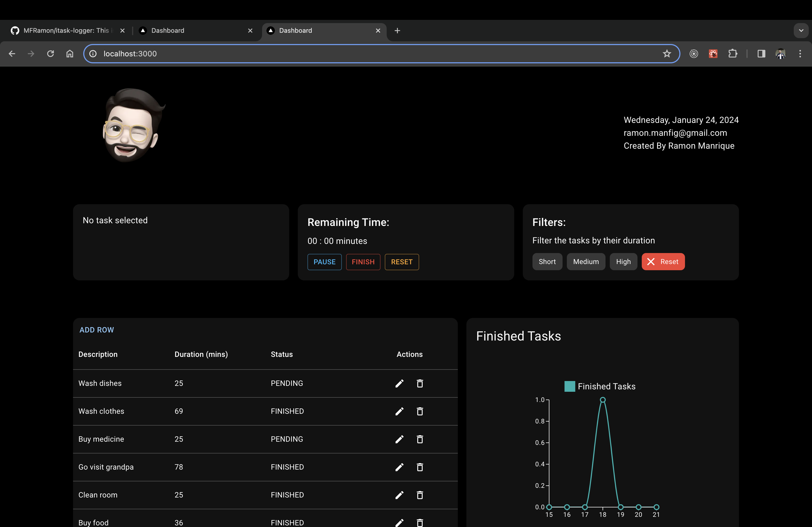
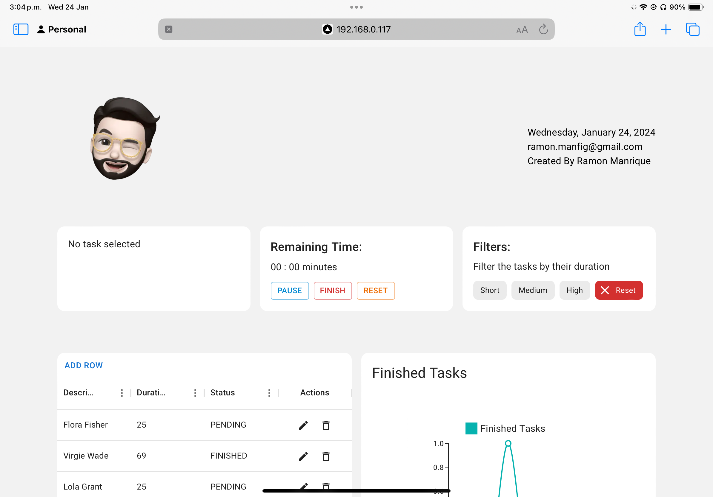
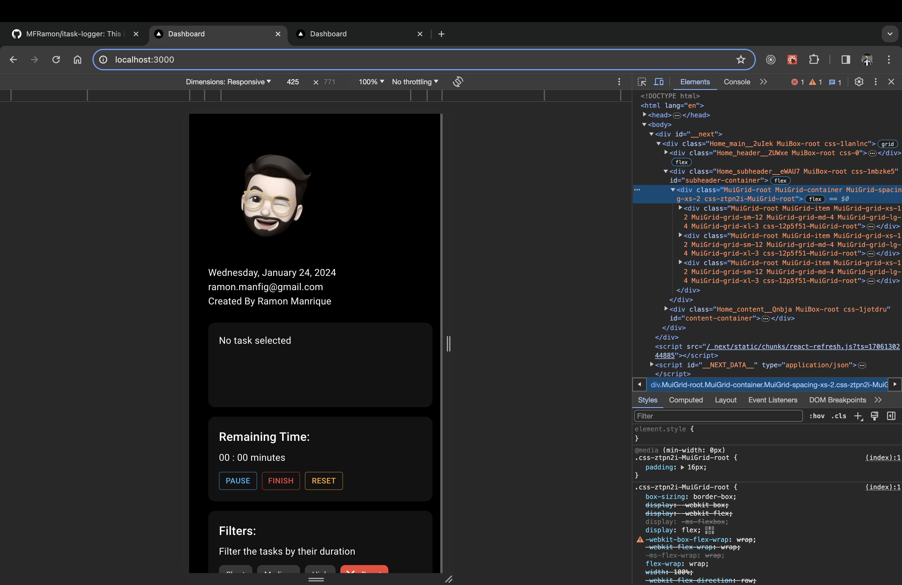

# Task Logger.

This is a project that manages your daily tasks and gives you access to how much time have you used and how many time have you spent on them. It also provides a chart where you can visually track the progress of the last week.

# Tech Stack.

| Dependency title | Version |
| ---------------- | ------- |
| next             | 14.0.4  |
| react            | 18      |
| eslint           | 8       |
| prettier         | 3.2.4   |
| typescript       | 5       |
| mui/material     | 5.15.4  |

## Install process and scripts.

Install dependencies :

    npm run install

Run the dev server :

    npm run dev

Get a list of files that need formatting :

    npm run format

Format all the files that needed formatting :

    npm run format:fix

Run the unit tests :

    npm run format:fix

## File Structure.

```
| Directory     | Content
| ------------- | -------------
| components    | Components that are used in parent compoentns
| helpers       | Functions that are used across different files
| pages         | Components that act as the pages in the application
| styles        | Global styles, mixins, themes are places here
| tests         | Unit tests for components
```

## Application's functionalities.

In this application the functionalities that the user can do are the following :

- Create a task.
- Update the description and duration of the task.
- Delete a task.
- Reorder the list of tasks by description, duration or status.
- Start, pause, resume and finish the timer for a given task.
- See a list of finished tasks.
- Check a graphic of the finished tasks in the last week.
- Filter the set of tasks by their duration (Short, Medium, and High).
- Support dark mode based on the user's OS settings.
- The responsiveness is preserved across devices.

# Design inspiration and concept

When I started working on the idea of how I would love to see the project in real life I used the Freeform to create a basic skeleton mockup so I can stablish the visual idea that I wanted to focus.
This is how it looked in the begining.



# Responsiveness on different devices.

## Laptop



## Tablet



## Mobile



## Learn More

To learn more about Next.js, take a look at the following resources:

- [Next.js Documentation](https://nextjs.org/docs) - learn about Next.js features and API.
- [Learn Next.js](https://nextjs.org/learn) - an interactive Next.js tutorial.

You can check out [the Next.js GitHub repository](https://github.com/vercel/next.js/) - your feedback and contributions are welcome!

## Deploy on Vercel

The easiest way to deploy your Next.js app is to use the [Vercel Platform](https://vercel.com/new?utm_medium=default-template&filter=next.js&utm_source=create-next-app&utm_campaign=create-next-app-readme) from the creators of Next.js.

Check out our [Next.js deployment documentation](https://nextjs.org/docs/deployment) for more details.
